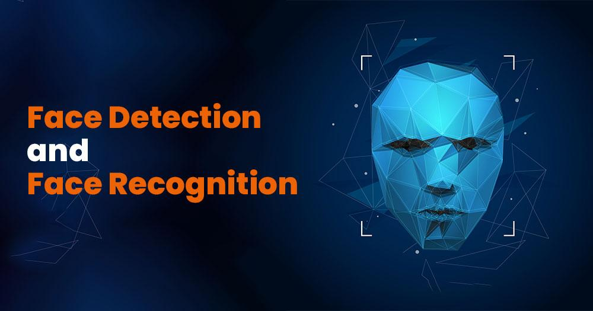

# Course Attendance System
<div align="center">
    <a></a>
</div>
Say goodbye to tedious roll calls! This project introduces a comprehensive system for managing attendance, harnessing facial detection and recognition technologies to identify individual students and register their attendance. Developed with Python, RetinaFace, Face_Recognition, and OpenCV, the system offers an efficient and automated solution for monitoring attendance across diverse settings such as educational institutions and workplaces.

Users can upload their images into the system's database, which is then utilized for facial recognition during attendance checks. Recognized faces are cross-referenced with the database, and attendance records are instantly updated in real time. 

This project serves as a compelling demonstration of how computer vision and machine learning can modernize traditional processes, improving efficiency and accuracy.

## Table of Contents

- [Course Attendance System with Facial Recognition](#course-attendance-system-with-facial-recognition)
  - [Table of Contents](#table-of-contents)
  - [Introduction](#introduction)
      - [Project Description](#project-description)
      - [Website Screenshots](#website-screenshots)
  - [Datasets](#datasets)
      - [Raw Images Summary](#raw-images-summary)
      - [Raw Screenshots](#raw-screenshots)
      - [Processed Images Summary](#processed-images-summary)
      - [Processed Screenshots](#processed-screenshots)
  - [Method](#method)
      - [RetinaFace](#retinaface)
      - [Retinaface Output Screenshots](#retinaface-output-screenshots)
      - [Face Recognition](#face-recognition)
      - [Face Recognition Output Screenshots](#face-recognition-output-screenshots)
  - [Results](#results)
  - [Technical Information](#technical-information)
  - [Benefits](#benefits)
  - [Applications](#applications)
  - [Future Improvements](#future-improvements)
   
## Introduction

### Project Description
In conventional attendance systems, the manual process of marking attendance is often time-consuming and error-prone. However, with advancements in machine learning and computer vision, we now can automate this process, enhancing efficiency and accuracy.

Introducing our Face Recognition Attendance System, specifically crafted to capitalize on these technologies, delivering a smooth and automated attendance tracking solution. Utilizing face recognition technology, the system effortlessly identifies individuals and records their attendance, eliminating the need for manual input and mitigating the risk of errors or unauthorized entries.

Developed using Python, RetinaFace, Face_Recognition, and OpenCV, our system integrates these tools seamlessly. Python provides the backend operations, OpenCV (Open Source Computer Vision Library), a popular computer vision library, to capture and preprocess images for face recognition, retina face facilitates face detection and Python library face_recognition which is built on top of Dlib provides a simple API for face recognition tasks.

Whether you're an educational institution seeking to streamline attendance management or a corporation aiming to automate employee check-ins, our Face Recognition Attendance System offers a dependable and effective solution.

### Website Screenshots

<figure align="center"> 
  
  <figcaption>Home Page of the Interface</figcaption>
</figure>


## Datasets:

### Raw Images Summary:

### Raw Screenshots:

### Processed Images Summary:

### Processed Screenshots:


## Method:

### RetinaFace:


### Retinaface Output Screenshots:
<figure align="center"> 
  
  <figcaption>Home Page of the Interface</figcaption>
</figure>


### Face Recognition:
To encode the face from the image we used the Python library face_recognition which is built on top of [Dlib](http://dlib.net/) state-of-the-art face recognition built with deep learning and provides a simple API for face recognition tasks. This also provides a simple `face_recognition` command line tool that lets
you do face recognition on a folder of images from the command line!

**Python Module**:
- You can import the `face_recognition` module and then easily manipulate faces with just a couple of lines of code. It's super easy!
- API Docs: [https://face-recognition.readthedocs.io](https://face-recognition.readthedocs.io/en/latest/face_recognition.html).

**Automatically find all the faces in an image**:

```python
import face_recognition

image = face_recognition.load_image_file("your_file.jpg")
face_locations = face_recognition.face_locations(image)

# face_locations is now an array listing the coordinates of each face!
```

### Face Recognition Output Screenshots:
<figure align="center"> 
  
  <figcaption>Home Page of the Interface</figcaption>
</figure>


## Results:


## Technical Information:

- **Programming Language**: Python
- **Face Detection**: RetinaFace
- **Face Recognition**:  World's simplest face recognition library (face_recognition) to recognize and manipulate faces from Python.
- **Computer Vision Library**: OpenCV

## Benefits:

- **Effortless Efficiency**: Automates attendance, saving time and resources.
- **Increased Accuracy**: Reduces human error compared to manual roll calls.
- **Enhanced Convenience**: Provides a faster and more user-friendly approach for everyone.
- **Flexible Scalability**: Adapts to accommodate different group sizes.

## Applications:

- **Educational Institutions**: Streamlines attendance management and ensures accurate student records.
- **Workplaces**: Simplifies employee attendance tracking and supports flexible work arrangements.
- **Access Control Systems**: Offers an additional layer of security by integrating face recognition for entry.


## Future Improvements:

In the foreseeable future, there are numerous avenues for refining and broadening the system:

- **Smoother User Experience**:
    - **Visually Appealing Interface**: A more engaging and user-friendly interface is in the works to make interacting with the system a breeze.
    - **Data First, Capture Later**: We're refining the image capture process to ensure all necessary information is entered before an image is added to the database.
    - **Smarter ID Assignment**: Say goodbye to manual counting! We'll optimize ID allocation to automatically fill in missing gaps (e.g., if the IDs are 8001,8002,8003,8004,[ ],8006,8007,8008, the new image's ID will be 8005).

- **Beyond the Local Machine**:
    - **Deployment on Cloud Platforms**: We're aiming to make the system accessible from anywhere by deploying it on platforms like Google cloud, Azure, AWS, and Heroku freeing it from the limitations of a local machine.

- **Security Boost**:
    - **Enhanced Security**: We're committed to safeguarding your data! We'll implement more robust methods for data handling and user authentication.

- **Expanded Functionality:**:
    - **Student Login**: Students will soon be able to log in using passwords, offering them greater control over their attendance data.
    - **Dedicated Teacher Database**: A separate database for teachers is on the horizon. Teachers will log in using usernames and passwords for secure access.
    - **Teacher-Centric View**: Logged-in teachers will have the power to view student attendance reports specific to the classes they teach.

- **Advanced Features (Future Explorations)**:
    - **Improved Error Handling and User Feedback**: Refining error handling and user feedback will make the system more user-friendly and robust.
    - **Real-time Attendance Updates**: We're exploring implementing real-time updates, so attendance is reflected instantly upon face recognition.
    - **Integration with Other Systems**: Seamless integration with existing systems like learning management systems or student information systems is a potential future endeavor.


